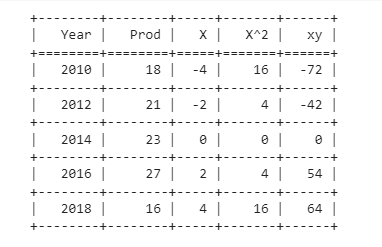
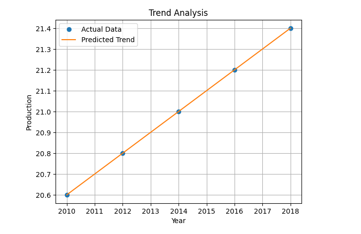

# Ex.No: 02 LINEAR AND POLYNOMIAL TREND ESTIMATION
Date: 23/02/2024
### AIM:
To Implement Linear and Polynomial Trend Estiamtion Using Python.

### ALGORITHM:
Import necessary libraries (NumPy, Matplotlib)

Load the dataset

Calculate the linear trend values using least square method

Calculate the polynomial trend values using least square method

End the program
### PROGRAM:
### A - LINEAR TREND ESTIMATION
```python
import numpy as np
from tabulate import tabulate
import matplotlib.pyplot as plt


x = [2010, 2012, 2014, 2016, 2018]
y = [18, 21, 23, 27, 16]


mean_x = np.mean(x)


X = x - mean_x

x2 = X**2
xy = X * y


table = np.column_stack([x, y, X, x2, xy])
print(tabulate(table, headers=["Year", "Prod", "X", "X^2", "xy"], tablefmt="grid"))


n = len(x)
b = (n * np.sum(xy) - np.sum(y) * np.sum(X)) / (n * np.sum(x2) - (np.sum(X))**2)
a = np.mean(y) - b * np.mean(X)


predicted_y = a + b * X

print("a:", a)
print("b:", b)
print("Predicted Values:", predicted_y)
print("Trend Equation: y = %.2f + %.2fx" % (a, b))

  plt.plot(x, predicted_y, 'o', label='Actual Data')
  plt.plot(x, predicted_y, '-', label='Predicted Trend')
  plt.xlabel('Year')
  plt.ylabel('Production')
  plt.title('Trend Analysis')
  plt.legend()
  plt.grid(True)
  plt.show()
```
### B- POLYNOMIAL TREND ESTIMATION
```python
## Polynomial TRend EStimation 4th degree
import numpy as np
from tabulate import tabulate
# x = list(map(int, input("Enter a list of years").split()))
# y = list(map(int, input("Enter a list of observation").split()))
x = [2011,2012,2013,2014,2015,2016]
y = [100,107, 128, 140, 181,192]

X = [i - 2014 for i in x]
x2 = [i** 2 for i in X]
xy = [i* j for i, j in zip(X, y)]
x3 = [i** 3 for i in X]
x4 = [i** 4 for i in X]
x2y = [i*j for i,j in zip(x2,y)]
table = [[i, j, k, l, m,n,o,p] for i, j, k, l, m,n,o,p in zip(x, y, X, x2, x3,x4, xy, x2y)]
print(tabulate (table, headers=["Year", "Prod", "X=x-2014", "X^2", "X^3", "X^4","xy", "x2y"], tablefmt="grid"))
coeff=[[len(x), sum(X), sum (x2)], [sum(X), sum (x2), sum(x3)], [sum(x2), sum (x3), sum(x4)]]
Y=[sum(y), sum(xy), sum(x2y)]
A=np.array(coeff)
B=np.array (Y)
try:
  solution=np.linalg.solve(A,B)
  print(solution)
except:
  print("error")
```

### OUTPUT
## A - LINEAR TREND ESTIMATION



## B- POLYNOMIAL TREND ESTIMATION


### RESULT:
Thus the python program for linear and Polynomial Trend Estiamtion has been executed successfully.
